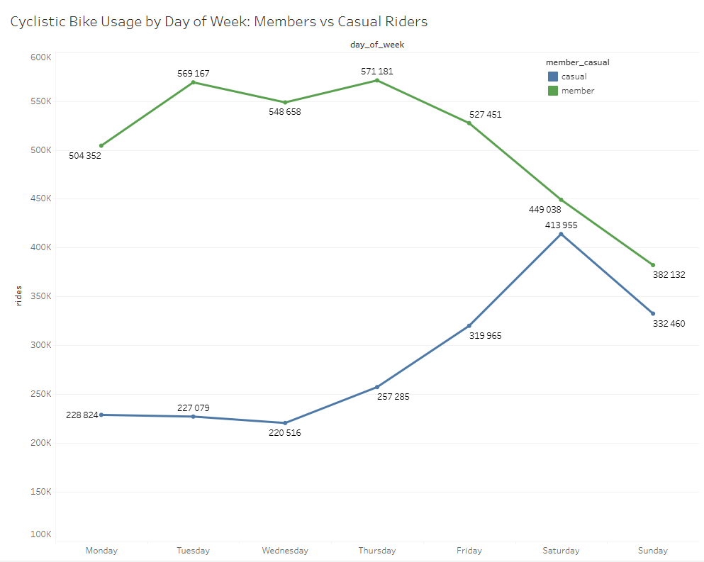
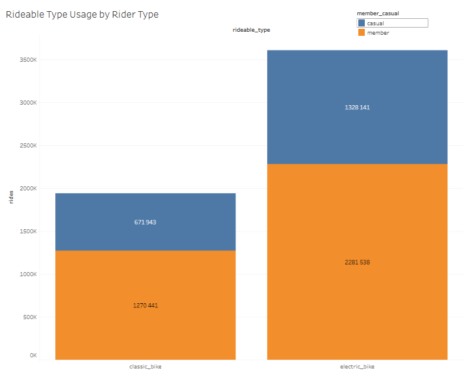

# CYCLISTIC BIKE SHARE ANALYSIS #
Data analysis project exploring how casual riders and members use Cyclistic bikes differently.

Business task
Cyclistic wants to **increase the number of annual memberships**. 
The goal of this analysis is to **understand how casual riders and annual members use Cyclistic bikes differently.**

Stakeholders
- Lily Moreno (Marketing Director)
- Cyclistic Marketing Team
- Cyclistic Executive Team

## 1. ASK ##

Three questions will guide the future marketing program:
1. How do annual members and casual riders use Cyclistic bikes differently?
2. Why would casual riders buy Cyclistic annual memberships?
3. How can Cyclistic use digital media to influence casual riders to become members?

Lily Moreno has assigned me the first question to answer: **How do annual members and casual riders use Cyclistic bikes differently?**

## 2. PREPARE ##

In this stage, the data required for the analysis was collected, organized, and evaluated for credibility. The dataset used in this project is the Cyclistic historical bike trip data, made available by Motivate International Inc. The data represents trip information for Cyclistic bike-share users and contains details about ride duration, start and end stations, bike types, and user types (annual members and casual riders). This dataset enables the analysis of usage patterns between different customer groups.

The data was downloaded as multiple CSV files covering the previous 12 months of trip data. Each file represents trips recorded during a specific month. All files were stored locally in a structured project folder to ensure proper organization and reproducibility of the analysis.

The dataset includes the following key variables used in this analysis:
- _ride_id_ - unique identifier for each ride
- _rideable_type_ - tyoe of bike used
- _started_at_ - timestamp when the ride started
- _ended_at_ – timestamp when the ride ended
- _start_station_name_ – name of the starting station
- _end_station_name_ – name of the ending station
- _member_casual_ – user type (annual member or casual rider)

Before proceeding to data processing, the dataset was reviewed to ensure it met the **ROCCC criteria (Reliable, Original, Comprehensive, Current, and Cited).** The data is considered reliable because it originates from the official Cyclistic bike-share system and is publicly available for analytical purposes.

After verifying the dataset structure and credibility, the data was ready to be cleaned and transformed in the next stage of the analysis.

## 3. PROCESS ##

### STEP 1. COMBINE THE DATASETS ###

All monthly trip datasets were combined into a single table in Google BigQuery to simplify analysis and ensure the full dataset can be queried efficiently. This unified table contains **5,552,092 rows**, representing all recorded bike trips for the selected period.

### STEP 2. INITIAL DATA EXPLORATION ###

The first step was to explore the dataset and verify that the main fields contain expected values.

**Total number of rows**

```sql
SELECT COUNT(*) AS total_rows
FROM `cyclistic-bike-share-heinnurm.bike_share_data.trips_2025`
```

Result: total_rows = 5,552,092

**Verify rider types**

Cyclistic differentiates between casual riders and annual members, which is central to the business question.

```sql
SELECT DISTINCT member_casual
FROM `cyclistic-bike-share-heinnurm.bike_share_data.trips_2025`
```

Result: member, casual

This confirms that the dataset contains only the two expected rider types.

**Verify bike types**

The available bike types were also checked.

```sql
SELECT DISTINCT rideable_type
FROM `cyclistic-bike-share-heinnurm.bike_share_data.trips_2025`
```

Result: electric_bike, classic_bike

**Verify date range**

Trip timestamps were examined to ensure that the data falls within the expected time range.

```sql
SELECT 
  MIN(started_at) AS min_start,
  MAX(started_at) AS max_start,
  MIN(ended_at) AS min_end,
  MAX(ended_at) AS max_end
FROM `cyclistic-bike-share-heinnurm.bike_share_data.trips_2025`
```

This check ensures there are no obvious timestamp anomalies.

### STEP 3. DUPLICATE CHECK ###

To verify data integrity, duplicate ride IDs were checked.

```sql
SELECT 
  COUNT(*) AS total_rows,
  COUNT(DISTINCT ride_id) AS distinct_ride_ids
FROM `cyclistic-bike-share-heinnurm.bike_share_data.trips_2025`
```

**Result:**
- total_rows = 5,552,092
- distinct_ride_ids = 5,552,092

Since both values match, the dataset contains no duplicate ride records.

### STEP 4. IDENTIFY MISSING VALUES ###

Next, the dataset was checked for NULL values in key columns.

```sql
SELECT
  COUNTIF(start_station_name IS NULL) AS null_start_station,
  COUNTIF(end_station_name IS NULL) AS null_end_station,
  COUNTIF(started_at IS NULL) AS null_started_at,
  COUNTIF(ended_at IS NULL) AS null_ended_at,
  COUNTIF(member_casual IS NULL) AS null_member_type
FROM `cyclistic-bike-share-heinnurm.bike_share_data.trips_2025`
```

A relatively large number of records contain missing values for _start_station_name_ and _end_station_name_. This is common in bike-share datasets and may occur when rides begin or end outside official docking stations or when station metadata is unavailable.

However, the critical analytical fields are complete:
- _started_at_ – no missing values
- _ended_at_ – no missing values
- _member_casual_ – no missing values

Because the main objective of the analysis is to compare **casual riders and annual members, the missing station names do not significantly affect the core analysis.**

Therefore, these rows will be **retained in the dataset.**

## 4. ANALYSE ##

To answer the business question “How do annual members and casual riders use Cyclistic bikes differently?”, the trip dataset was analyzed using SQL in BigQuery.

The analysis focused on identifying behavioral differences between casual riders and annual members, including ride frequency, ride duration, and temporal usage patterns. Understanding these differences is essential for Cyclistic’s marketing team, whose goal is to convert casual riders into annual members. 

To uncover these insights, the dataset was first prepared by creating additional variables such as ride_length, day_of_week, and month. These variables enabled the analysis of ride duration, weekly usage patterns, and seasonal trends.

The analysis then examined several key metrics:
- total number of rides by rider type
- average ride duration
- ride duration distribution
- ride frequency by weekday
- average ride length by weekday

These metrics help reveal how each rider group interacts with the bike-share system and provide valuable insights for developing targeted marketing strategies aimed at increasing annual memberships.

### 4.1. Created the ride_length column ###

A new column called _ride_length_ was created by calculating the difference between _ended_at_ and _started_at_. This metric represents how long each bike ride lasted.

Why this is important: 
- Ride duration helps identify how riders use Cyclistic bikes
- It allows comparison between casual riders and annual members
- Differences in ride duration can indicate whether bikes are used for commuting or leisure activities

Additional variables were also created:
- _day_of_week_ – identifies which day a ride started, helping reveal weekly usage patterns
- _month_ – helps identify seasonal trends in bike usage

These variables allow deeper behavioral analysis over time.

### 4.2. Total number of rides by user type ###

The number of rides was calculated for each user group.

```sql
SELECT
  member_casual,
  COUNT(*) AS total_rides
FROM `cyclistic-bike-share-heinnurm.bike_share_data.cleaned_trips`
GROUP BY member_casual
```

| User type | Total rides |
|-----------|-------------:|
| Casual riders | 2,000,084 |
| Annual members | 3,551,979 |

This shows that annual members generate the majority of rides in the system.
This supports Cyclistic's business strategy, since annual members are the most profitable customer segment.

However, casual riders still represent a significant user group, meaning there is strong potential to convert them into members.

### 4.3. Average and median ride duration ###

The average and median ride duration were calculated for each rider type.

```sql
SELECT
  member_casual,
  AVG(ride_length_minutes) AS avg_ride_length,
  APPROX_QUANTILES(ride_length_minutes, 100)[OFFSET(50)] AS median_ride_length
FROM `cyclistic-bike-share-heinnurm.bike_share_data.cleaned_trips`
GROUP BY member_casual
```

| User type | Average ride length (minutes) | Median ride length (minutes) |
|-----------|--------------|-------------:|
| Casual riders | 22.14 min | 11 min |
| Annual members | 11.92 min | 8 min |

Using both the average and the median gives a more complete picture of rider behavior.

The average shows the overall mean ride duration, but it can be influenced by unusually long rides. The median shows the middle value, meaning that 50% of rides are shorter and 50% are longer. Because of this, the median is often a better measure of a “typical” ride.

This reveals a clear behavioral difference:
- Casual riders take significantly longer rides on average
- Members take shorter rides on average
- If the median for casual riders is also clearly higher, this confirms that their rides are generally longer, not just affected by a few extreme values
- If the average is much higher than the median, this suggests the presence of long outlier rides

### 4.4. Ride duration distribution ###

Ride duration extremes were also analyzed. These values help identify extreme ride durations and potential data anomalies. 

```sql
SELECT
  member_casual,
  AVG(ride_length_minutes) AS avg_ride,
  MAX(ride_length_minutes) AS max_ride,
  MIN(ride_length_minutes) AS min_ride,
  COUNTIF(ride_length_minutes = 0) AS zero_minute_rides,
  COUNTIF(
    (member_casual = 'member' AND ride_length_minutes = 1499) OR
    (member_casual = 'casual' AND ride_length_minutes = 1574)
  ) AS max_length_rides
FROM `cyclistic-bike-share-heinnurm.bike_share_data.cleaned_trips`
GROUP BY member_casual
```

| Metric                      | Members  | Casual   |
| --------------------------- | -------- | -------- |
| Maximum ride length         | 1499 min | 1574 min |
| Minimum ride length         | 0 min    | 0 min    |
| Rides with 0 min duration   | 69,260   | 79,112   |
| Rides with maximum duration | 948      | 1        |

The dataset contains a notable number of rides with a duration of 0 minutes for both rider types. In practice, a ride duration of exactly zero minutes is unlikely because unlocking and returning a bike typically requires at least a short amount of time. These entries may therefore represent system recording issues, cancelled rides immediately after unlocking, or timestamp inaccuracies.

Maximum ride durations appear to be very rare events. For example, only one casual ride reached the maximum duration of 1574 minutes, while 948 member rides reached the maximum value of 1499 minutes. These extreme values likely represent outliers rather than typical user behavior.

Overall, while both rider types occasionally have very long rides, the majority of trips are considerably shorter, and extreme values should be interpreted cautiously when analyzing ride duration patterns.

### 4.5. Rides by weekday ###

Ride frequency was analyzed for each day of the week.

```sql
SELECT
  member_casual,
  day_of_week,
  COUNT(*) AS rides
FROM `cyclistic-bike-share-heinnurm.bike_share_data.cleaned_trips`
GROUP BY member_casual, day_of_week
ORDER BY day_of_week
```

Example values:

| member_casual | day_of_week |  rides |
| ------------- | ----------- | -----: |
| member        | Friday      | 527451 |
| casual        | Friday      | 319965 |
| member        | Monday      | 504352 |
| casual        | Monday      | 228824 |
| member        | Saturday    | 449038 |
| casual        | Saturday    | 413955 |
| member        | Sunday      | 382132 |
| casual        | Sunday      | 332460 |
| member        | Thursday    | 571181 |
| casual        | Thursday    | 257285 |
| member        | Tuesday     | 569167 |
| casual        | Tuesday     | 227079 |**
| casual        | Wednesday   | 220516 |
| member        | Wednesday   | 548658 |

Key observations:
- Members ride most frequently on weekdays, especially Tuesday, Wednesday, and Thursday
- Casual riders ride most on weekends, particularly Saturday and Sunday

### 4.6. Average ride length by weekday ###

| member_casual | day_of_week | avg_ride_length_minutes | median_ride_length_minutes |
| ------------- | ----------- | ----------------------: | -------------------------: |
| member        | Friday      |                   11.91 |                          8 |
| casual        | Friday      |                   22.07 |                         11 |
| member        | Monday      |                   11.51 |                          8 |
| casual        | Monday      |                   21.84 |                         10 |
| member        | Saturday    |                   13.08 |                          9 |
| casual        | Saturday    |                   24.82 |                         13 |
| member        | Sunday      |                   13.17 |                          9 |
| casual        | Sunday      |                   25.67 |                         13 |
| member        | Thursday    |                   11.48 |                          8 |
| casual        | Thursday    |                   19.40 |                         10 |
| member        | Tuesday     |                   11.51 |                          8 |
| casual        | Tuesday     |                   19.36 |                         10 |
| member        | Wednesday   |                   11.38 |                          8 |
| casual        | Wednesday   |                   18.23 |                          9 |

```sql
SELECT
  member_casual,
  day_of_week,
  AVG(ride_length_minutes) AS avg_ride_length_minutes,
  APPROX_QUANTILES(ride_length_minutes, 2)[OFFSET(1)] AS median_ride_length_minutes
FROM `cyclistic-bike-share-heinnurm.bike_share_data.cleaned_trips`
GROUP BY member_casual, day_of_week
ORDER BY day_of_week
```

The results show clear differences between casual riders and members.
- Casual riders consistently have longer ride durations on every day of the week. Their average ride length ranges from 18 to 26 minutes, while member rides remain much shorter at around 11–13 minutes.
- Median values confirm the same pattern. Member rides typically last 8–9 minutes, whereas casual rides range between 9 and 13 minutes, indicating that the difference is consistent and not caused only by extreme values.

### 4.7. Rides by month ###

| Month     | Member rides | Casual rides | Total rides |
| --------- | ------------ | ------------ | ----------- |
| January   | 113,037      | 24,742       | 137,779     |
| February  | 124,144      | 27,757       | 151,901     |
| March     | 212,268      | 85,862       | 298,130     |
| April     | 262,137      | 109,239      | 371,376     |
| May       | 319,845      | 182,770      | 502,615     |
| June      | 386,795      | 292,006      | 678,801     |
| July      | 440,106      | 323,352      | 763,458     |
| August    | 452,439      | 337,878      | 790,317     |
| September | 449,294      | 265,268      | 714,562     |
| October   | 422,058      | 224,038      | 646,096     |
| November  | 257,401      | 99,082       | 356,483     |
| December  | 112,455      | 28,090       | 140,545     |

```sql
SELECT
  member_casual,
  month,
  COUNT(*) AS rides
FROM `cyclistic-bike-share-heinnurm.bike_share_data.cleaned_trips`
GROUP BY member_casual, month
ORDER BY month
```

Data shows that: 
- Both rider types increase during spring and summer.
- Casual riders show much stronger seasonality.
- Casual rides peak during summer months (June–August).

### 4.8. Bikes type usage ###

| Rideable Type | Member Rides | Casual Rides | Total Rides |
|:--------------|-------------:|-------------:|------------:|
| Classic Bike  | 1,270,441    | 671,943      | 1,942,384   |
| Electric Bike | 2,281,538    | 1,328,141    | 3,609,679   |

```sql
SELECT
  member_casual,
  rideable_type,
  COUNT(*) AS rides
FROM `cyclistic-bike-share-heinnurm.bike_share_data.cleaned_trips`
GROUP BY member_casual, rideable_type
```

Data shows that: 
- Both rider groups frequently use classic bikes.
- Members show strong adoption of electric bikes, likely for commuting efficiency.
- Casual riders use electric bikes more often.

Casual riders appear to prioritize accessibility and flexibility, while members prioritize efficiency and reliability.

### 4.9. Summary ###

The following table summarizes the number of rides and average ride duration by weekday for casual riders and annual members.

```sql
CREATE OR REPLACE TABLE `cyclistic-bike-share-heinnurm.bike_share_data.analysis_summary` AS
SELECT
  member_casual,
  day_of_week,
  COUNT(*) AS rides,
  AVG(ride_length_minutes) AS avg_ride
FROM `cyclistic-bike-share-heinnurm.bike_share_data.cleaned_trips`
GROUP BY member_casual, day_of_week
```

| Day of Week | Casual Rides | Avg Casual Ride (min) | Member Rides | Avg Member Ride (min) |
| ----------- | ------------ | --------------------- | ------------ | --------------------- |
| Monday      | 228,824      | 21.84                 | 504,352      | 11.51                 |
| Tuesday     | 227,079      | 19.36                 | 569,167      | 11.51                 |
| Wednesday   | 220,516      | 18.23                 | 548,658      | 11.38                 |
| Thursday    | 257,285      | 19.40                 | 571,181      | 11.48                 |
| Friday      | 319,965      | 22.07                 | 527,451      | 11.91                 |
| Saturday    | 413,955      | 24.82                 | 449,038      | 13.08                 |
| Sunday      | 332,460      | 25.67                 | 382,132      | 13.17                 |

Key Insights: 
- The analysis shows clear behavioral differences between casual riders and annual members.
- Casual riders take longer trips. Their average ride duration ranges from about 18–26 minutes, while member rides average around 11–13 minutes.
- Members ride more frequently during weekdays, suggesting that they use Cyclistic bikes mainly for commuting or daily transportation.
- Casual riders are more active during weekends, with the highest number of rides occurring on Saturday and Sunday.
- Weekend rides by casual riders are also longer in duration, indicating that these trips are likely recreational or leisure-oriented.
- Overall, the data suggests that members primarily use bikes for routine transportation, while casual riders tend to use them for leisure activities, especially on weekends.

## 5. SHARE ##

## Cyclistic Bike Usage by Day of Week



**Key Insights**
- The analysis shows clear behavioral differences between casual riders and annual members.
- Casual riders take longer trips. Their average ride duration ranges from about 18–26 minutes, while member rides average around 11–13 minutes.
- Members ride more frequently during weekdays, suggesting that they use Cyclistic bikes mainly for commuting or daily transportation.
- Casual riders are more active during weekends, with the highest number of rides occurring on Saturday and Sunday.
- Weekend rides by casual riders are also longer in duration, indicating that these trips are likely recreational or leisure-oriented.
- Overall, the data suggests that members primarily use bikes for routine transportation, while casual riders tend to use them for leisure activities, especially on weekends.

## Number of Rides by Day of Week and Rider Type ##


## Bike Type Usage by Rider Type

 

**Key Insights**

- Electric bikes are significantly more popular than classic bikes for both rider groups. Total electric bike rides are nearly 1.7 million more than classic bike rides.
- Annual members use bikes more frequently overall, accounting for the majority of rides across both bike types.
- Members show especially strong preference for electric bikes, suggesting they are commonly used for commuting or regular travel.
- Casual riders also prefer electric bikes, which may indicate that electric bikes provide a more comfortable option for leisure or longer rides.

## 6. ACT ##

Based on the analysis of Cyclistic bike usage patterns, several key behavioral differences were identified between casual riders and annual members. Casual riders tend to take longer trips and are more active during weekends and summer months, while annual members use bikes more frequently during weekdays for commuting and short transportation trips.

To increase the number of annual memberships, the following marketing strategies are recommended:

**1. Promote weekend-to-membership conversion campaigns**

Casual riders show the highest activity on weekends and during summer months. Cyclistic could introduce targeted weekend promotions encouraging casual riders to upgrade to annual memberships. For example, offering a discounted membership after a certain number of weekend rides could motivate frequent casual riders to switch to a membership plan.

**2. Highlight cost savings and commuting benefits**

Annual members use bikes more frequently for short weekday trips, suggesting that memberships provide value for regular transportation. Marketing campaigns should emphasize the long-term cost savings and convenience of annual memberships compared to repeated casual rides.

**3. Use digital marketing to target frequent casual riders**

Cyclistic can leverage digital channels such as email campaigns, mobile app notifications, and social media advertising to target casual riders who frequently use the service. Personalized messages highlighting membership benefits, ride statistics, and seasonal promotions could encourage conversion to annual memberships.
